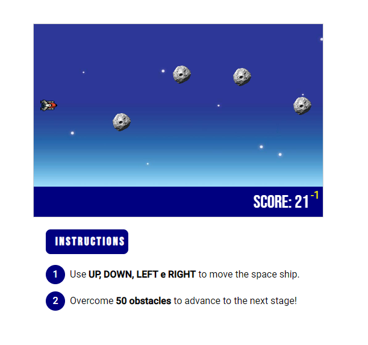

	

<h1 align="center">JS Canvas Game</h1>

## Status

<h4 align="center"> 
	JS Canvas Game - Finished! ✅
</h4>

## Description

JS Canvas Game is a simple example of how to use canvas HTML + JS for game mecanics.

## Content

- [Description](#description)
- [Status](#status)
- [Content](#content)
- [How to use it?](#how-to-use-it)
- [Stack and Technoloy](#stack-and-technology)
- [ApplicationPhotos](#application-photos)

## How to use it?

JS Canvas Game is an simple HTML + JS + CSS app.

1. Clone the repository
2. Respect the folder structure
3. Click on index.html

## Stack and Technology

- HTML
- CSS
- JS

## Application Photos

